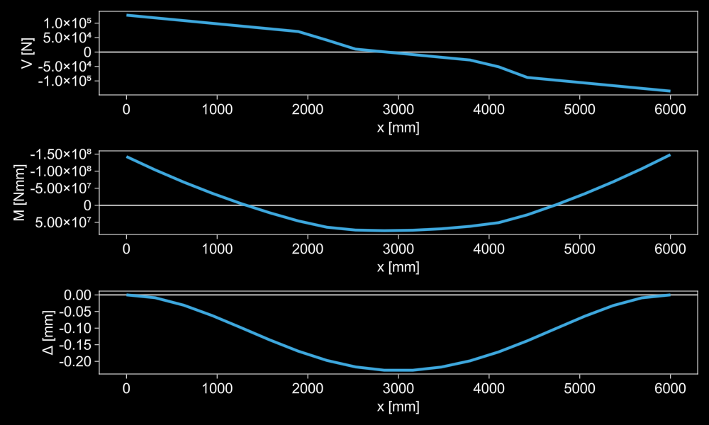
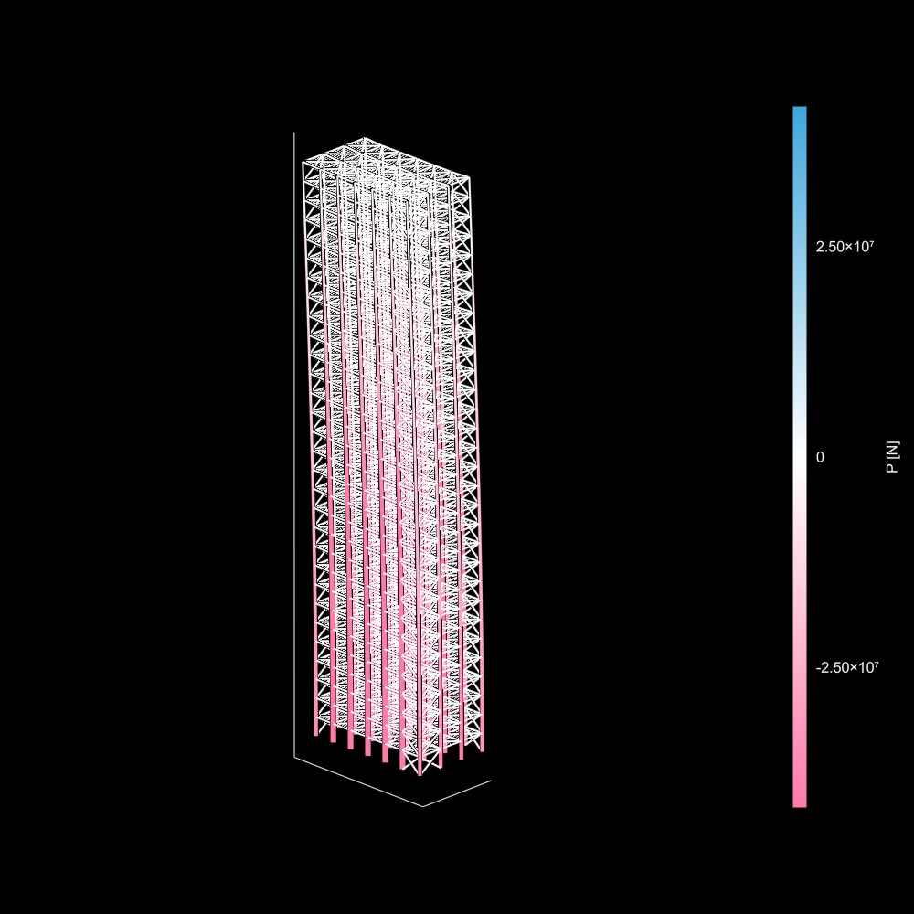
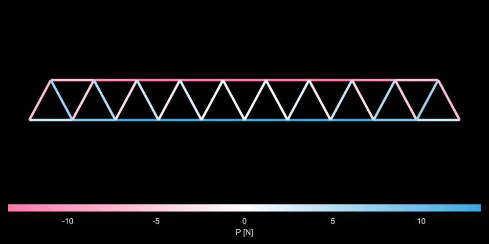
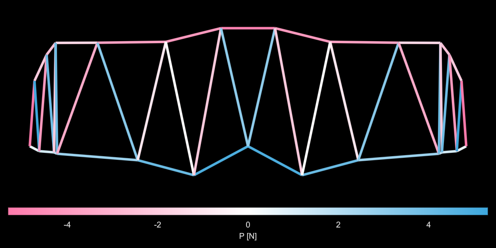
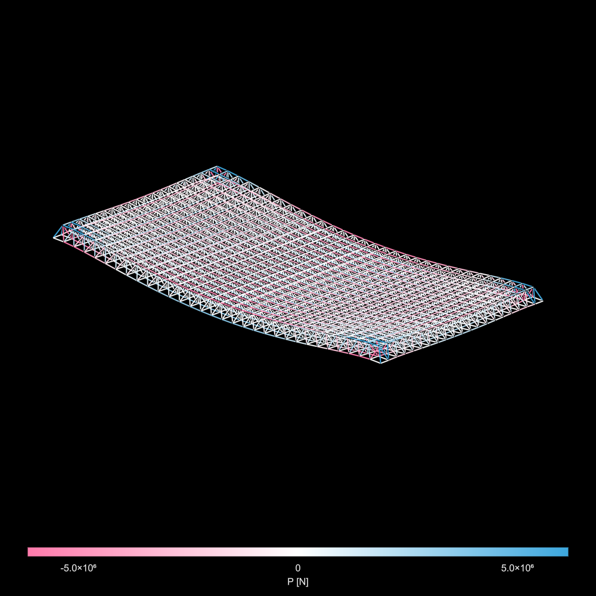
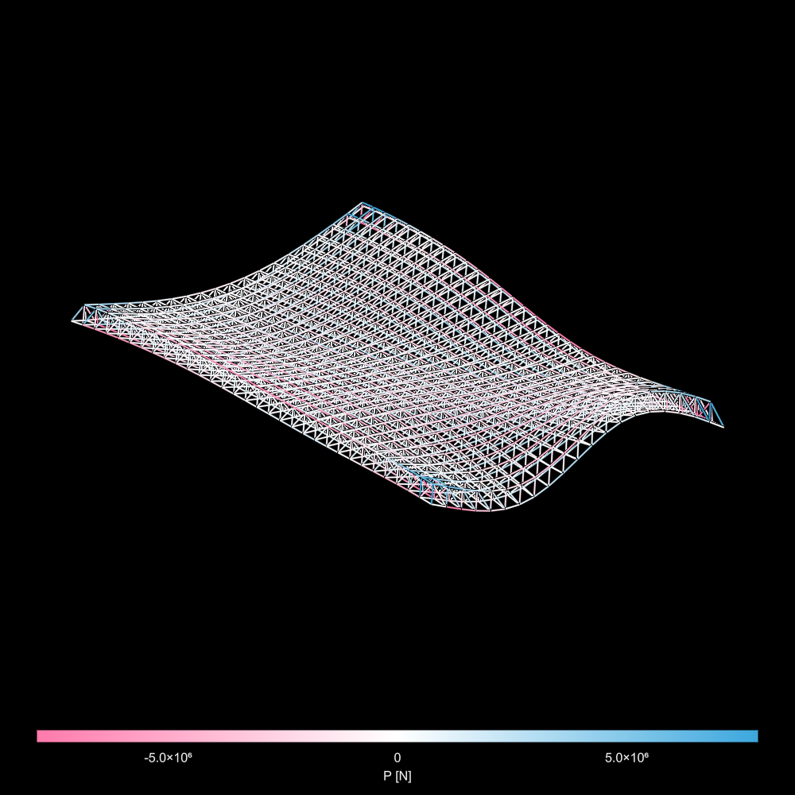

# AsapToolkit
Series of extension tools for [Asap.jl](https://github.com/keithjlee/Asap) including:

- Internal displacement analysis across an element: `ElementDisplacements`
- Internal force analysis across an element: `InternalForces`, `ForceEnvelopes`
- Automatic frame generation: `generateframe`
- Automatic 2D truss generation: `generatewarren2d`
- Automatic 3D spaceframe generation: `generatespaceframe`

# Element analysis
The internal forces for an element in an analyzed structure can be extracted via:
```julia
    InternalForces(element::Element, model::Model; resolution = 20)
```
Where `resolution` is the number of samples taken across the element. Results are stored in an `InternalForces` structure with the fields:
```julia
struct InternalForces
    element::Element
    resolution::Integer
    x::Vector{Float64}
    P::Vector{Float64}
    My::Vector{Float64}
    Vy::Vector{Float64}
    Mz::Vector{Float64}
    Vz::Vector{Float64}
end
```
Where y,z are with respect to the **local coordinate system** of the element.

Similar to force analysis, the transverse displacements can be extracted via `ElementDisplacements(element::Element, model::Model; resolution = 20)`. Result is in the form:
```julia
struct ElementDisplacements
    element::Element
    resolution::Integer
    x::Vector{Float64}
    ulocal::Matrix{Float64}
    uglobal::Matrix{Float64}
    basepositions::Matrix{Float64}
end
```

Where `ulocal` and `uglobal` are $3 \times \text{resolution}$ matrices where each row represents X, Y, and Z.

## Example:
```julia
section = toASAPframe(rand(allW()), Steel_Nmm.E, Steel_Nmm.G)

n1 = Node([0., 0., 0.], :fixed)
n2 = Node([6000., 0., 0.], :fixed)
nodes = [n1, n2]

element = Element(n1, n2, section)
elements = [element]

load1 = LineLoad(element, [0., 0., -30])
pointloads = [PointLoad(element, rand(), 25e3 .* [0., 0., -rand()]) for _ = 1:5]
loads = [load1; pointloads]

model = Model(nodes, elements, loads)
solve!(model)

fanalysis = InternalForces(element, model)
danalysis = ElementDisplacements(element, model)
```



force/displacement analysis for all elements in a structural model can be generated via:
- `forces(model::Model, increment::Real)`
- `displacements(model::Mode, increment::Real)`

Where `increment` is the absolute sampling distance along each element (not the number of samples taken in an element)

## Load envelopes
If the internal forces of an element across multiple load cases is desire, one can use:
```julia
load_envelopes(model::Model, loads::Vector{Vector}, increment::Real)
```
This generates a vector of `ForceEnvelopes` for each element, which stores the lower/upper bounds of internal forces:
```julia
struct ForceEnvelopes
    element::Element
    resolution::Integer
    x::Vector{Float64}
    Plow::Vector{Float64}
    Phigh::Vector{Float64}
    Mylow::Vector{Float64}
    Myhigh::Vector{Float64}
    Vylow::Vector{Float64}
    Vyhigh::Vector{Float64}
    Mzlow::Vector{Float64}
    Mzhigh::Vector{Float64}
    Vzlow::Vector{Float64}
    Vzhigh::Vector{Float64}
end
```

# Generation
## 3D Frame
`generateframe` can be used to create and analyze a 3D frame structure with joist -> girder -> column hierarchy, bi-directional X-bracing and optional braces at each XY bay to simulate a diaphragm.

```julia
generateframe(nx::Integer, 
    dx::Real, 
    ny::Integer, 
    dy::Real, 
    nz::Integer, 
    dz::Real, 
    joistSpacing::Real, 
    columnSection::Asap.Section, 
    primarySection::Asap.Section, 
    joistSection::Asap.Section, 
    braceSection::Asap.Section)
```

Where:
- `nx` number of bays in primary span direction
- `dx` bay spacing
- `ny` number of bays in joist span direction
- `dy` bay spacing
- `nz` number of stories
- `dz` floor height
- `joistSpacing` spacing between joists
- `columnSection` cross section properties for columns
- `primarySection` cross section properties for primary beams
- `joistSection` cross section properties for joists
- `braceSection` cross section properties for braces

Optional inputs with default values:
- `diaphragm::Bool = false` add a diaphragm to floor bays
- `diaphragmSection::Asap.section = nothing` if `diaphragm == true`, by default will assign the same section as the braces unless defined here.
- `columnRelease::Symbol = :fixedfixed` DOF releases for columns
- `primaryRelease::Symbol = :fixedfixed` DOF releases for primary beams
- `joistRelease::Symbol = :joist` DOF releases for joists
- `braceRelease::Symbol = :freefree` DOF releases for braces
- `columnPsi::Real = 0.` Angle of roll Ψ for column LCS
- `primaryPsi::Real = pi/2` Angle of roll Ψ for primary beam LCS
- `joistPsi::Real = pi/2` Angle of roll Ψ for joist LCS
- `base::Vector{<:Real} = [0., 0., 0.]` starting position of frame grid generation

The output is a `Frame` object that stores all user parameters as fields, and the analyzed structural model in `Frame.model`.

### Example
```julia

#choosing sections
begin
    W = allW()
    iStiffness = sortperm(getproperty.(W, :Ix))
    nsecs = length(W)

    mat = Steel_Nmm
    girder = toASAPframe((W[iStiffness])[Int(round(nsecs * 0.5))], mat.E, mat.G)
    joist = toASAPframe((W[iStiffness])[Int(round(nsecs * .2))], mat.E, mat.G)

    iArea = sortperm(getproperty.(W, :A))
    col = toASAPframe((W[iArea])[Int(round(nsecs * .75))], mat.E, mat.G)

    H = allHSSRound()
    iArea = sortperm(getproperty.(H, :A))
    nh = length(H)
    tube = toASAPframe((H[iArea])[Int(round(nh * 0.9))], mat.E, mat.G)

    girder.ρ = joist.ρ = tube.ρ = mat.ρ
end

# geometry hyperparameters for frame
begin
    nx = 3
    ny = 6
    nz = 30
    dx = 6000
    dy = 5000
    dz = 4200
end

# generate and extract
frame = generateframe(nx,
    dx,
    ny,
    dy,
    nz,
    dz,
    500,
    col,
    girder,
    joist,
    tube;
    columnPsi = pi/2,
    diaphragm = true,
    );

model = frame.model;
```



## 2D trusses
### Regularly spaced 
```julia
generatewarren2d(n::Integer,
    dx::Real,
    dy::Real,
    section::Asap.AbstractSection;
    type = :arch,
    base = [0., 0., 0.])
```

Where:
- `n` number of bays (must be odd)
- `dx` bay spacing in X direction
- `dy` depth of truss
- `section` element section

With optional parameters:
- `type::Symbol = :arch`: can be `:arch` or `:catenary` which chooses with the longer chord is the tensile or compressive chord
- `base::Vector{<:Real} = [0,0,0]`: base point for truss generation

#### Example
```julia

#parameters
n = 11
dx = 1500
dy = 1400
section = toASAPtruss(rand(allHSSRound()), Steel_Nmm.E)

#generate
warrentruss = generatewarren2d(n,
    dx,
    dy,
    section)

#extract
truss = warrentruss.model
```



### Irregularly spaced
```julia
generatewarren2d(xpositions::Vector{<:Real},
    ypositions::Vector{<:Real},
    ypositions2::Vector{<:Real},
    section::Asap.AbstractSection;
    type = :arch,
    base = [0., 0., 0.])
```

Where:
- `xpositions` x-positions of long chord nodes (should generally be in increasing order)
- `ypositions` y-positions of long chord nodes. `length(xpositions) == length(ypositions)`.
- `ypositions2` y-positions of short chord nodes. The x-positions are always centered between two long chord nodes. `length(ypositions) == length(ypositions2) + 1`
  
#### Example
```julia
#irregular
xpos = cumsum(rand(7) .* 2000) .+ 500
ypos = - sort(rand(7) .* 1000); ypos[1] = ypos[end] = 0.
ypos2 = sort(rand(6) .* 1500) .+ 1500

truss = generatewarren2d(xpos,
    ypos,
    ypos2,
    section)
```



## 3D spaceframes
### Regular spaceframe
```julia
generatespaceframe(nx::Integer,
        dx::Real,
        ny::Integer,
        dy::Real,
        dz::Real,
        section::Asap.AbstractSection;
        support = :corner,
        load = [0., 0., -10.],
        base = [0., 0., 0.])
```

Where:
- `nx` number of bays in x-direction
- `dx` bay spacing
- `ny` number of bays in y-direction
- `dy` bay spacing
- `dz` spaceframe depth
- `section` element properties

With optional parameters:
- `support::Symbol = :corner` support condition types. Choose from:
  - `:corner` support all nodes in each corner bay of the spaceframe (16 nodes total)
  - `:x` support all the extremity nodes aligned with x-axis (1-way span)
  - `:y` support all extremity nodes aligned with y-axis (1-way span)
  - `:xy` support all perimeter nodes (2-way span)
  - `:center` support the nodes that form the center bay of the structure
- `load::Vector{<:Real} = [0, 0, -10]` load applied to all bottom nodes (excluding supports)
- `base::Vector{<:Real} = [0,0,0]` starting point for generation
- 
#### Example
```julia
nx = 20
dx = 1000.
ny = 31
dy = 1300.
dz = 1250.

sec = rand(allHSSRound())
tube = toASAPtruss(sec, Steel_Nmm.E)
σ = 350.

sf = generatespaceframe(nx, dx, ny, dy, dz, tube; load = [0., 0., -30e3]);

truss = sf.truss;
```



### Irregular spaceframe
```julia
generatespaceframe(nx::Integer,
    dx::Real,
    ny::Integer,
    dy::Real,
    z0::Real,
    interpolator::Interpolations.AbstractExtrapolation,
    section::Asap.AbstractSection,
    offset = false;
    support = :corner,
    load = [0., 0., -10.],
    base = [0., 0., 0.])
```

The major differences are:
- `dz` is replaced with `z0`, the initial offset between the top surface and bottom surface of the spaceframe
- `interpolator` defines the z-height function of the spaceframe nodes
- `offset` determines whether the bottom plane remains in place or follows the top plane

`interpolator` must define a function that takes in two inputs (x,y coordinates) and returns a scalar value (z coordinate):

$$
\text{interpolator}: (x,y) \; \in \; \mathbb{R}^2 \rightarrow \mathbb{R}
$$

Where:
$$
x \in [0,1]\\
y \in [0,1]
$$

This can be generated using the `cubic_spline_interpolation` function in `Interpolations.jl`. See example below:

#### Example
```julia
n = 4
x = range(0,1,n)
y = range(0,1,n)
z = rand(n,n) .* 4500

itp = cubic_spline_interpolation((x,y), z)

@time sf = generatespaceframe(nx, dx, ny, dy, dz, itp, tube, true; load = [0., 0., -30e3]);
truss = sf.truss;
```

